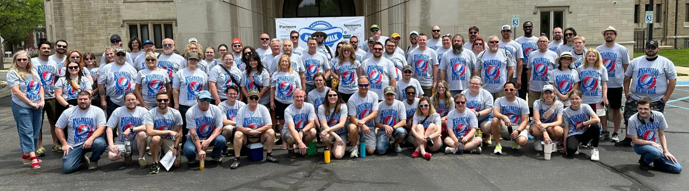
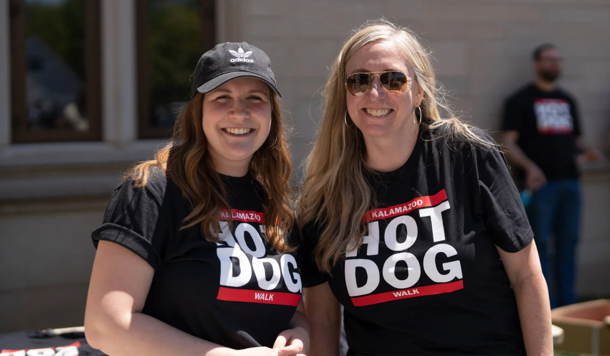

2025 marks the fifteenth annual Kalamazoo Hot Dog Walk, an event supporting
local businesses and [Kalamazoo Loaves & Fishes][]. The pandemic caused a pivot
to a safe, voucher format which served the mission successfully, therefore this
year we will once again have multiple options available for participants:

- The **live event** is back again, which involves participants riding buses
  to **six** restaurants in one afternoon on May 23 starting at 1pm: Coney
  Island, Nagle’s Top Dog & Malt Shoppe, Papa’s Italian Sausage, Ray Ray’s
  Italian Beef & Sausage, The Root Beer Stand, and Schultz’s Treat Street.
- Second, retaining the voucher option, registrants receive a packet containing
  **vouchers** good for one hot dog at each partner restaurant, redeemable
  throughout the year.
- Third, the bold may opt for both vouchers and the live event with the
  **combo meal** option.

Beginning on Tuesday, April 1, participants can register here for $53 (vouchers
only), $58 (event only), or $88 (vouchers and event). All registrants will
receive one commemorative t-shirt and proceeds benefit [Kalamazoo Loaves &
Fishes][].

## Registration Tips

### Register on April 1.

No joke. The event fills quickly. Don’t get left without a spot. We plan to fill
every seat, so there won’t be room for any late additions.

### Be sure you have the whole afternoon off.

It’s an all-or-nothing type deal. You need to be available the whole afternoon,
starting at 1 p.m. because we’re all riding together. Don’t make us explain how
a bus ride works.

### Try a dog from every stop.

Yeah, we know that sounds like a lot of food, but remember that one of the great
things about this event is trying something new. Even if you only take a bite,
at least you’ve tried it and your registration fee includes a dog at every stop
anyway.

### Want to help more?

Great! You can make an additional donation to [Kalamazoo Loaves & Fishes][] when
you register and we’ll have a collection box on the day of the event for further
contributions.

## Event Tips

### Have kids or other family that would get a kick out of the event?

You can always register them if you think it’s worth it (only registered guests
may ride the bus), but our advice is to invite them to see you off at check-in
or to stop by to see the bus arrive at one of our stops. This is a great way for
kids or family members to witness the fun and snap a picture without the
commitment or expense of the full event.

### Go potty before you come to the event.

We do not have bathroom facilities at our check-in location. The good news is we
won’t be there long.

### Don’t order anything else at the restaurants.

All of our restaurant partners have other awesome menu items that you should
try… another time. We have the ordering process down to a science; don’t slow us
down by placing additional food and drink orders. Thanks in advance for that
one.

### Water is your friend.

Keep yourself hydrated throughout the event, but drinking anything other than
water will just fill you up. You won’t need any help doing that.

### Talk to strangers.

The KHDW attracts some of the coolest people in Kalamazoo, but you won’t know
that if you sit with the same people all day. Mix it up; you’ll be glad you did.

### Use the hashtag #kzoohotdogwalk before, during and after the event.

Tell everyone that you plan to attend, keep them updated throughout the event
and then let them know how great a time you had when it’s over. In fact, you
could make a post about the KHDW now. Go ahead.

[kalamazoo loaves & fishes]: https://kzoolf.org
